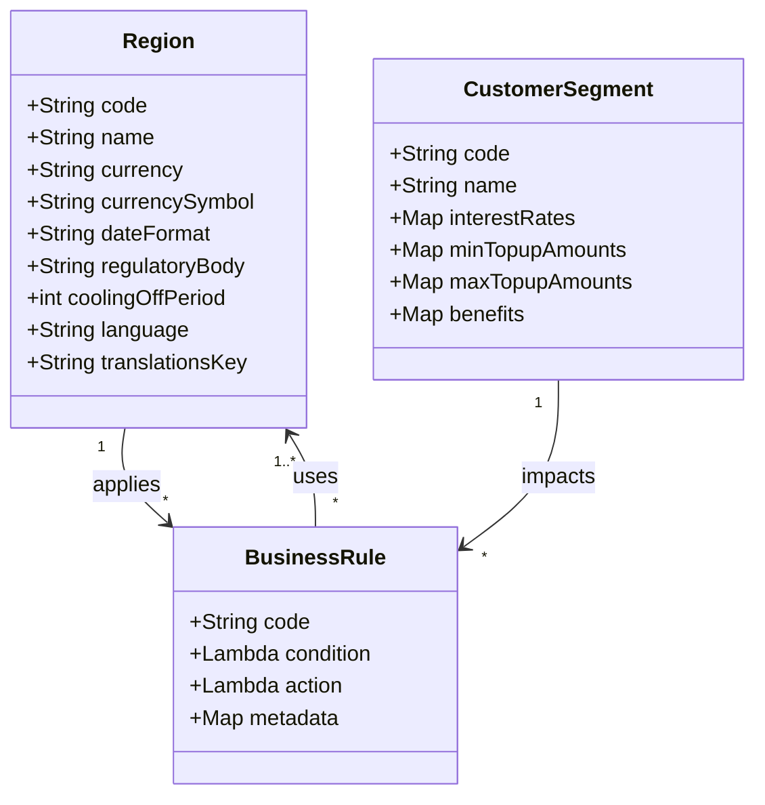

# Regions in FinApp DSL

Regions are a core concept in the FinApp DSL, representing different geographic markets with their specific regulatory requirements, currencies, and business rules.

## Overview

A region in the DSL represents a specific market where financial products are offered. Each region has its own:

- Currency and formatting
- Regulatory requirements
- Date formats
- Language and translations
- Market-specific business rules

## Region Structure

```clojure
(def uk-region
  {:code "UK" 
   :name "United Kingdom"
   :currency "GBP"
   :currencySymbol "£"
   :dateFormat "DD/MM/YYYY"
   :regulatoryBody "FCA"
   :coolingOffPeriod 14
   :language "en-GB"
   :translationsKey "uk_translations"})
```

## Key Attributes

| Attribute | Description | Example |
|-----------|-------------|---------|
| `:code` | Unique identifier for the region | `"UK"` |
| `:name` | Human-readable name | `"United Kingdom"` |
| `:currency` | ISO currency code | `"GBP"` |
| `:currencySymbol` | Currency symbol for display | `"£"` |
| `:dateFormat` | Format string for dates | `"DD/MM/YYYY"` |
| `:regulatoryBody` | Primary regulatory authority | `"FCA"` |
| `:coolingOffPeriod` | Mandatory cooling-off period (days) | `14` |
| `:language` | Primary language code | `"en-GB"` |
| `:translationsKey` | Key for translation lookups | `"uk_translations"` |

## Currently Supported Regions

The FinApp DSL currently supports the following regions:

- **UK (United Kingdom)** - Regulated by the FCA
- **HK (Hong Kong)** - Regulated by the HKMA
- **SG (Singapore)** - Regulated by the MAS

## Creating a New Region

To add a new region to the system, define a new region map with all required attributes:

```clojure
(def us-region
  {:code "US" 
   :name "United States"
   :currency "USD"
   :currencySymbol "$"
   :dateFormat "MM/DD/YYYY"
   :regulatoryBody "FDIC"
   :coolingOffPeriod 10
   :language "en-US"
   :translationsKey "us_translations"})
```

## Regional Business Rules

Each region may have specific business rules that apply only within that region. For example:

- Different minimum/maximum loan amounts
- Different interest rate calculations
- Region-specific eligibility criteria
- Different documentation requirements

## Using Regions in the DSL

Regions are used throughout the DSL as a key parameter for business rules and calculations:

```clojure
;; Get currency for a region
(core/get-region-currency uk-region) ;; => "GBP"

;; Apply region-specific business rules
(apply-amount-rule "UK" "Basic" 10000) ;; => Applies UK-specific rules

;; Check eligibility with region-specific criteria
(apply-eligibility-rule customer-data "UK")
```

## Region-Specific Validation

When implementing validation logic, consider region-specific requirements:

```clojure
(defn validate-loan-amount [amount region]
  (let [min-amount (get-min-amount-by-region (:code region))
        max-amount (get-max-amount-by-region (:code region))]
    (cond
      (< amount min-amount) 
      {:valid false :message (str "Amount below minimum for " (:name region))}
      
      (> amount max-amount) 
      {:valid false :message (str "Amount exceeds maximum for " (:name region))}
      
      :else 
      {:valid true})))
```

## Mermaid Diagram: Region Relationships



## Further Reading

- [Customer Segments](segments.md) - How customer segments interact with regions
- [Business Rules](business_rules.md) - How to implement region-specific business rules
- [Loan Topup Guide](../guides/loan_topup.md) - Example implementation using regions 